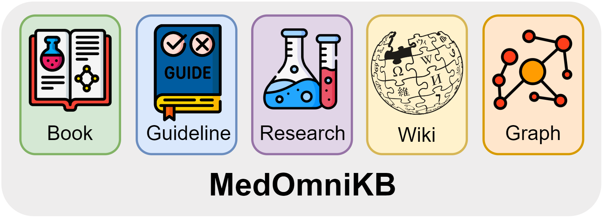

# MedOmniKB

  

      </a>
  

## Data

| Retrieval Source | Dataset                     | Data Structure | Access Link                                                                 |
|------------------|-----------------------------|----------------|------------------------------------------------------------------------------|
| Book             | 18k_books1        | Text           | -                                                                            |
|                  | medqa_textbooks_en           | Text           | [Link](https://drive.google.com/file/d/1ImYUSLk9JbgHXOemfvyiDiirluZHPeQw/view?usp=sharing ) |
|                  | statpearls                   | Text           | [Link](https://ftp.ncbi.nlm.nih.gov/pub/litarch/3d/12/ )                      |
| Guideline        | guidelines2       | Text           | [Link](https://huggingface.co/datasets/epfl-llm/guidelines )                 |
| Research         | pubmed                       | Text           | [Link](https://ftp.ncbi.nlm.nih.gov/pubmed/baseline/ )                        |
| Wiki             | wikipedia                    | Text           | [Link](https://huggingface.co/datasets/wikimedia/wikipedia/viewer/20231101.en ) |
| Graph            | umls                         | Graph          | [Link](https://www.nlm.nih.gov/research/umls/licensedcontent/umlsknowledgesources.html ) |
|                  | drugbank                     | Table          | [Link](https://go.drugbank.com/releases/latest )                              |

1 We cannot publicly release the original content of the e-books, but we can only share the [book names](./book_names.json). Please purchase the books and process them into text yourself.  
2 Additionally, we used the [meditron scripts](https://github.com/epfLLM/meditron/tree/a7c7cda3014e537f0df2ec58f836fbe920d6283b/gap-replay/guidelines) to scrape guideline websites that cannot be redistributed.

## Processing Scripts

### Text

Please refer to [MedRAG](https://github.com/Teddy-XiongGZ/MedRAG/tree/7599a728a28789fd601728c08d313b1148051f41/src/data) for processing text data. Optional retrieval frameworks include Qdrant, Faiss, Milvus, Weaviate, etc.

### Table
A simple dictionary structure mapping each name to its associated attributes is adequate for storing the data. 

### Graph

1. Manually update the latest data into two files. Update the [Relationship abbreviation information](https://www.nlm.nih.gov/research/umls/knowledge_sources/metathesaurus/release/abbreviations.html#mrdoc_RELA) into the file `./umls/data/rela_doc.txt`, and update the [Vocabulary information](https://www.nlm.nih.gov/research/umls/sourcereleasedocs/ ) into the file `./umls/data/vocab_doc.txt`. **Make sure to retain the `\t` tab delimiter.**

2. Place the files `MRCONSO.RRF`, `MRDEF.RRF`, and `MRREL.RRF` into the directory `./umls/data`.

3. First, run `./umls/generate_umls.py` to generate `umls.sqlite3`.

4. Then, run `./umls/run_retriever.py` to retrieve the UMLS locally.