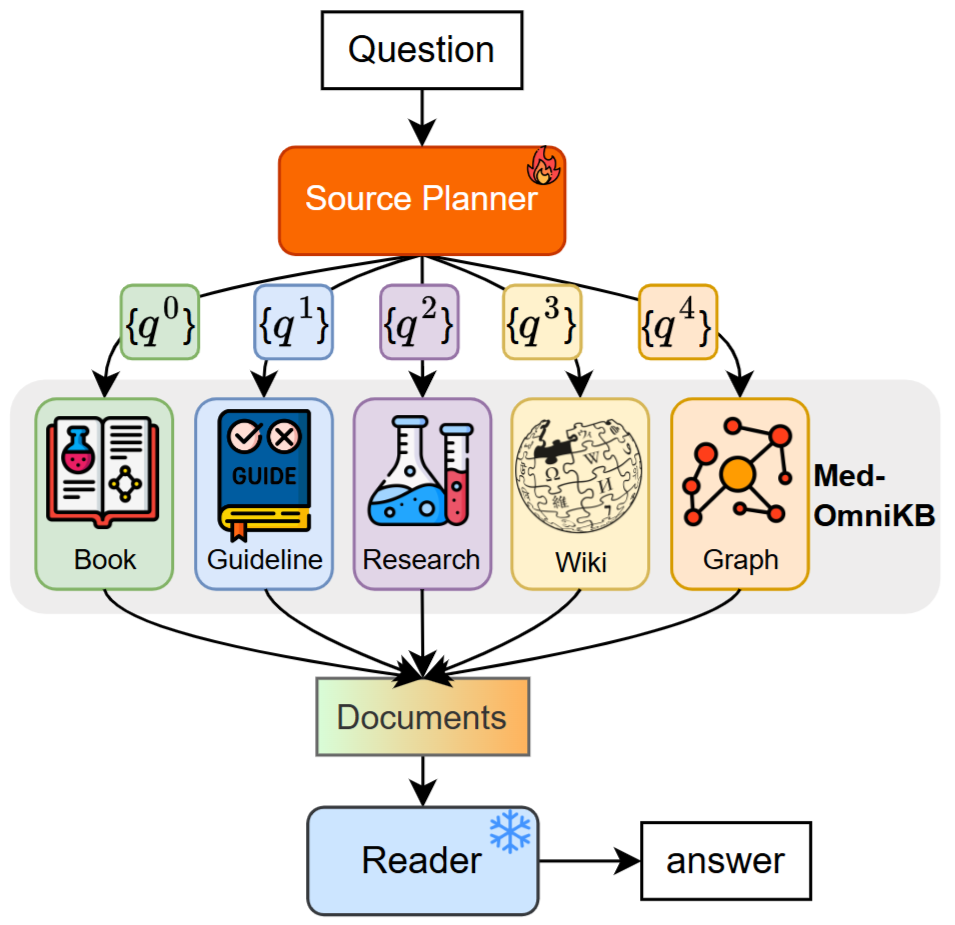

# Omni-RAG-Medical
<div align="center">
  <p>
      </a>
  </p>
</div>

The official implementation of “Towards Omni-RAG: Comprehensive Retrieval-Augmented Generation for Large Language Models in Medical Applications”  

## Dataset

The datasets are stored in `data/data_processed/{train/dev/test}_{short/long}.json`. We do not release the MIMIC4ED dataset due to copyright restrictions. Please refer to [MedS-Ins](https://github.com/MAGIC-AI4Med/MedS-Ins/tree/185cfc04a27023983e48b357a6f2fd525049b9af/data_preparing) for data preprocessing.

## Retrieval Database

Please refer to [`./MedOmniKB`](./MedOmniKB).

## Commands

Note that `run.py` supports distributed inference across any number of hosts (with shared storage) and can handle multiple processes simultaneously. 

```bash
# Reader (QA)

## No Retrieval
python run.py --system reader --dataset test_short --llm_name Qwen2.5-7B-Instruct

## Add Retrieval (The retrieval results can be specified using the `plan_name` parameter.)
python run.py --system reader --dataset test_short --llm_name Qwen2.5-7B-Instruct --plan_name system=planner_prompt,dataset=test_short,llm_name=Qwen2.5-7B,plan_name=,debug=False

# Planner (generate plan, retrieve and store the retrieval results)

## Prompting
python run.py --system planner_prompt --dataset test_short --llm_name Qwen2.5-7B-Instruct

## Planning exploration and judging
python run.py --system planner_find --dataset train_short --llm_name Qwen2.5-72B-Instruct-AWQ
```

We have also prepared data processing scripts compatible with the [TRL framework](https://github.com/huggingface/trl ), enabling quick training setup:  
- [`get_sft_data.py`](./utils/get_sft_data.py) — for [SFT training](https://github.com/huggingface/trl/blob/c13de6f9c0af41a01f16d09c2d0888021ca115e1/trl/scripts/sft.py )  
- [`get_dpo_data.py`](./utils/get_sft_data.py) — for [DPO training](https://github.com/huggingface/trl/blob/c13de6f9c0af41a01f16d09c2d0888021ca115e1/trl/scripts/dpo.py )  


# Citation

```
@article{chen2025towards,
  title={Towards Omni-RAG: Comprehensive Retrieval-Augmented Generation for Large Language Models in Medical Applications},
  author={Chen, Zhe and Liao, Yusheng and Jiang, Shuyang and Wang, Pingjie and Guo, Yiqiu and Wang, Yanfeng and Wang, Yu},
  journal={arXiv preprint arXiv:2501.02460},
  year={2025}
}
```


